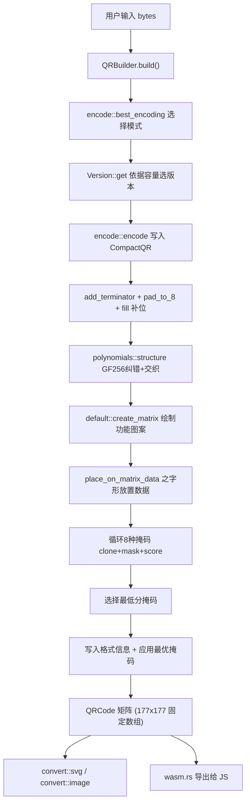
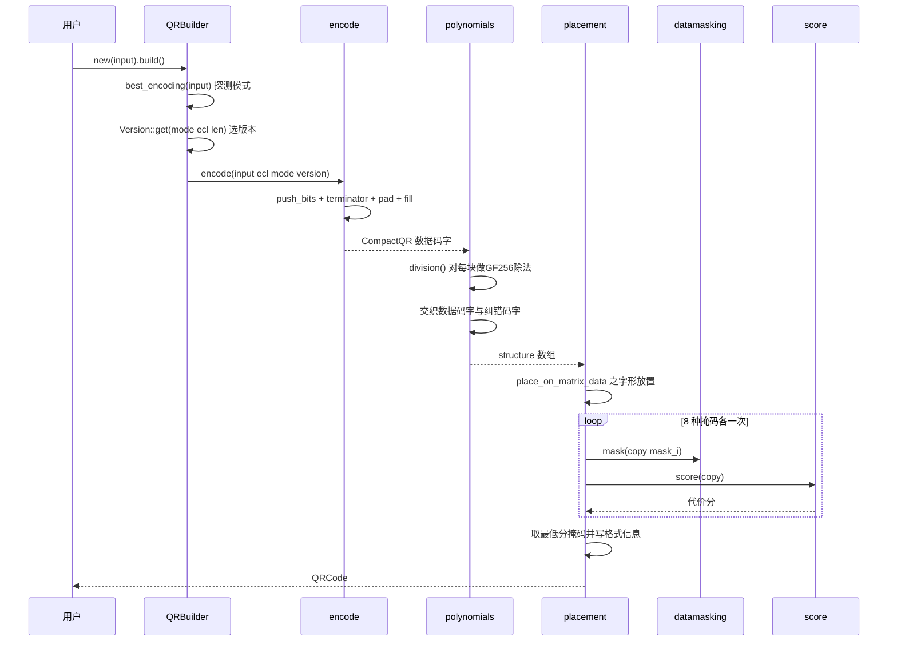

# fast_qr 系统架构文档

> **状态**：现行　｜　日期：2026-09-14　｜　索引：[docs/README-导航与索引.md](../README-导航与索引.md) §7

## 概述

fast_qr 是一个用 Rust 编写的高性能 QR 码生成库，用于将任意字节流编码为符合 ISO/IEC 18004 标准的 QR 码矩阵，并可转换为 SVG、PNG 或 Unicode 字符画。它使 Rust 开发者、前端开发者（通过 npm 发布的 WASM 包）能够以极低的延迟生成 QR 码，官方基准测试显示其速度约为同类库 `qrcode` crate 的 6-7 倍（V03H 场景 82us vs 535us）。

系统零运行时依赖（核心代码仅依赖 Rust `core`/`std`），采用固定大小数组与单字节打包的模块表示，所有容量表、生成多项式、格式信息均为编译期常量，`release` 配置启用 LTO 与 `opt-level = 's'`。除 Rust 原生目标外，同一份核心代码通过 `wasm-bindgen` 编译为 WASM 并发布到 npm（包名 `fast_qr`），支持浏览器与 Node.js。

**基本信息**：

| 项 | 值 |
|------|------|
| 当前版本 | 0.14.0 |
| 许可证 | MIT |
| 最低 Rust 版本 | 1.59 |
| 核心源码规模 | 约 4450 行（不含测试） |
| 测试代码规模 | 约 7100 行（约为核心的 1.6 倍） |

## 技术栈

**语言与运行时**
- Rust 2021 edition（核心库，`rust-version = 1.59`）
- Rust → WebAssembly（`wasm32-unknown-unknown` target，`wasm-bindgen 0.2`）
- JavaScript / TypeScript（WASM 侧的胶水层，由 wasm-bindgen 自动生成）

**构建与工具链**
- Cargo（构建、测试、基准）
- wasm-pack / 自定义 `wasm-pack.sh`（nightly `-Z build-std` + `panic_immediate_abort` + `wasm-opt -Oz`）
- criterion 0.6（基准测试框架）

**依赖**（生产依赖极少）
- `resvg 0.45.1`（可选，仅在 `image` feature 下用于 SVG 栅格化为 PNG）
- `wasm-bindgen`（可选，仅 wasm32 target）
- dev-dependencies：`qrcode 0.14.1`（基准对照库）、`base64 0.22.1`

**CI/CD**
- GitHub Actions（`.github/workflows/rust.yml`）：多 feature × 多 target 构建矩阵、测试、示例构建

## 项目结构

```
fast_qr/
├── Cargo.toml           # 包定义、feature flags、release 优化配置
├── src/
│   ├── lib.rs           # crate 入口，模块声明与公开导出
│   ├── qr.rs            # QRCode 结构体与 QRBuilder（API 入口）
│   ├── encode.rs        # 数据编码（Numeric/Alphanumeric/Byte 三模式）
│   ├── compact.rs       # CompactQR 比特缓冲区
│   ├── polynomials.rs   # GF(256) 多项式除法与码字交织（纠错）
│   ├── hardcode.rs      # 硬编码常量表（分组、格式信息、容量、生成多项式）
│   ├── version.rs       # Version 枚举（V01-V40）与容量选择逻辑
│   ├── ecl.rs           # ECL 纠错级别枚举（L/M/Q/H）
│   ├── module.rs        # Module：单字节打包的矩阵单元
│   ├── default.rs       # 空矩阵绘制（finder/timing/alignment/version/format）
│   ├── placement.rs     # 数据放置与掩码择优主流程
│   ├── datamasking.rs   # 8 种掩码图案实现
│   ├── score.rs         # 掩码评分（4 条规则）
│   ├── helpers.rs       # 终端字符画输出
│   ├── wasm.rs          # wasm-bindgen 导出（JS API）
│   ├── convert/
│   │   ├── mod.rs       # Shape、Color、ConvertError 等公共定义
│   │   ├── svg.rs       # SvgBuilder（SVG 字符串/文件输出）
│   │   └── image.rs     # ImageBuilder（PNG 输出，依赖 resvg）
│   └── tests/           # 11 个测试模块（含大量黄金数据表）
├── benches/qr.rs        # criterion 基准（对比 qrcode crate，V03H/V10H/V40H）
├── examples/            # 5 个示例（simple/svg/image/custom/embed）
├── wasm-pack.sh         # WASM 发布构建脚本
└── .github/workflows/   # CI
```

**入口点**
- Rust API 入口：`fast_qr::qr::QRBuilder`（`src/qr.rs:200`）
- JS API 入口：`src/wasm.rs` 导出的 `qr()` 与 `qr_svg()`

## 子系统

### 1. 编码子系统（encode）
**目的**：根据输入自动选择最优编码模式，按规范 8.4 节将数据编码为比特流。
**位置**：`src/encode.rs`、`src/compact.rs`
**关键文件**：`encode.rs`（三模式编码器）、`compact.rs`（比特写入器）
**依赖**：`hardcode`（cci_bits、data_bits）、`compact::CompactQR`、`version::Version`
**被依赖**：`placement::create_matrix`

### 2. 纠错子系统（polynomials）
**目的**：在 GF(256) 上做多多项式除法生成纠错码字，并按规范做块间交织。
**位置**：`src/polynomials.rs`、`src/hardcode.rs`
**关键文件**：`polynomials.rs`（LOG/ANTILOG 表 + `division` + `structure`）、`hardcode.rs`（`get_polynomial`、`ecc_to_groups`）
**依赖**：`hardcode`、`Version`、`ECL`
**被依赖**：`placement::create_matrix`

### 3. 矩阵构造子系统（default + placement）
**目的**：绘制功能图案（finder/timing/alignment/version/format/dark module），按之字形路径放置数据比特，评估 8 种掩码并选出最优。
**位置**：`src/default.rs`、`src/placement.rs`、`src/datamasking.rs`、`src/score.rs`
**依赖**：`module`、`hardcode`（格式信息表、PERCENT_SCORE）、`polynomials`
**被依赖**：`qr::QRCode::new`

### 4. 转换输出子系统（convert）
**目的**：将 QRCode 矩阵渲染为 SVG 字符串（可选 6 种形状）或 PNG 位图。
**位置**：`src/convert/`
**关键文件**：`convert/mod.rs`（Shape 枚举、Builder trait 依赖）、`convert/svg.rs`（SvgBuilder）、`convert/image.rs`（ImageBuilder → resvg）
**依赖**：`Module`；`image` feature 额外依赖 `resvg`
**feature 关系**：`svg` 独立开关；`image` 隐含启用 `svg`

### 5. WASM 绑定子系统（wasm）
**目的**：向 JavaScript 暴露 `qr(content)` 与 `qr_svg(content, SvgOptions)` 两个函数及配置类。
**位置**：`src/wasm.rs`
**依赖**：`wasm-bindgen`、`convert`（svg feature）
**构建链**：nightly `-Z build-std=std,panic_abort` + `panic_immediate_abort` → `wasm-bindgen` CLI → `wasm-opt -Oz`

### 6. 测试与基准子系统
**目的**：黄金数据回归（对照规范逐版本验证容量表、多项式、矩阵结构）、与 `qrcode` crate 的纠错输出交叉验证、criterion 性能基准。
**位置**：`src/tests/`（11 个模块）、`benches/qr.rs`

## 数据流

### 编码主流程



### QRBuilder.build() 调用时序



## 核心设计决策（重写时必须理解的精髓）

以下 7 项是 fast_qr 性能优势的来源，逐条对应代码位置：

1. **固定大小矩阵**：`QRCode.data` 是 `[Module; 177*177]` 字段而非堆分配矩阵（`src/qr.rs:32`）。注释明确记录了演进过程：模板矩阵更快但二进制体积暴涨，`Vec::with_capacity` 性能极差。
2. **单字节模块编码**：`Module(pub u8)`，bit0 存明暗值，bit1-3 存 8 种类型之一（Data/Finder/Alignment/Timing/Format/Version/DarkModule/Empty）（`src/module.rs:42`）。掩码/评分时用 `module_type() == Data` 单次比较即可跳过功能模块，`toggle()` 仅异或 1 位。
3. **预分配比特缓冲**：`CompactQR::from_version` 按版本最大字节数一次性 `vec![0; len*8]`（`src/compact.rs:100`），编码期间零扩容。
4. **编译期常量表**：版本容量是 `const fn` 嵌套 match（`src/version.rs:96`，819 行）；分组表 `ecc_to_groups` 将两个 `(count, size)` 对打包进一个 u32（`src/hardcode.rs:14`）；格式信息表、GF(256) LOG/ANTILOG 表均为 static 常量。运行时只有查表，无计算。
5. **掩码择优的成本控制**：基础矩阵只构建一次，8 轮循环中每轮仅 `clone()` 矩阵 + 掩码 + 评分（`src/placement.rs:94-109`）；评分用 11 位滚动窗口值比较检测类 finder 图案（`src/score.rs:104`），列评分用栈上缓冲避免转置拷贝（`src/score.rs:156`）。
6. **无分支热点**：`push_bits` 位操作全程无分支（`src/compact.rs:177`）；`division` 用查表乘法（`LOG[(by[j] + alpha) % 255]` 异或）替代模运算。
7. **体积优化链**：`opt-level='s'` + LTO + `codegen-units=1` + `panic='abort'`（Cargo.toml release profile）；WASM 侧再加 nightly `build-std` + `panic_immediate_abort` + `wasm-opt -Oz`（`wasm-pack.sh`）。

## 跨语言重写评估（摘要）

详细分析见 [跨语言重写评估](./专有概念/跨语言重写评估.md)。结论摘要：

- **推荐方案 A（生态最大化）**：C 或 Zig 重写核心（约 2500 行管线），导出 C ABI，各语言写薄绑定。约 2-4 周达到功能对齐。
- **推荐方案 B（服务端）**：Go 重写，接受 10-20% 性能折损换取部署与并发便利。约 1-2 周。
- **重写启动顺序**：先移植数据表（用 `src/tests/version.rs` 3876 行现成黄金数据验证）→ 搭 Module/CompactQR 数据结构 → 自底向上实现 encode → polynomials → default → placement → masking/score → 输出层。
- **最大风险**：掩码评分语义细节（ISO N3 规则的 quiet zone 处理）与 WASM 体积优化链在非 Rust 语言无等价物，必须以矩阵快照测试而非"按规范重写"作为正确性基线。
